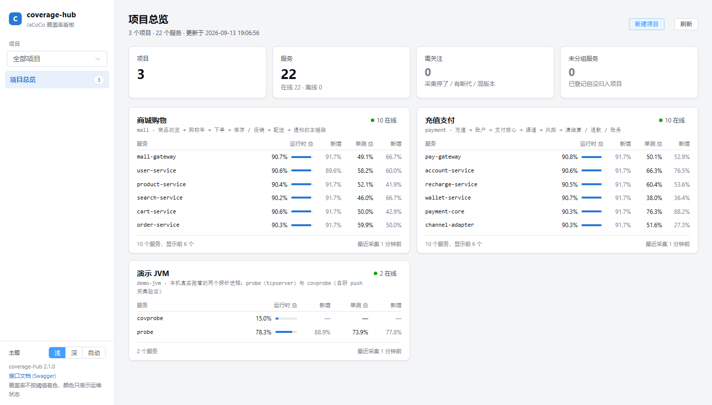
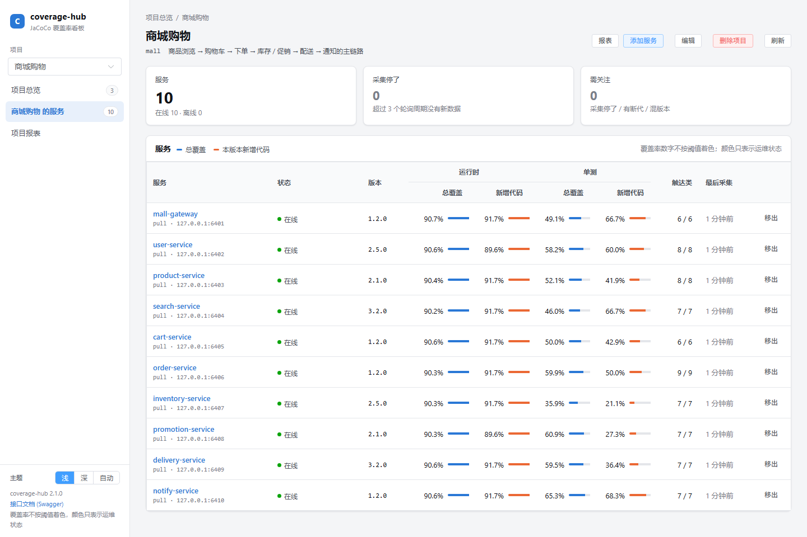
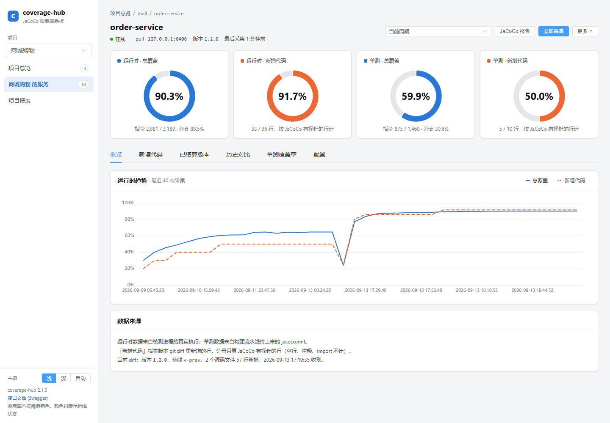
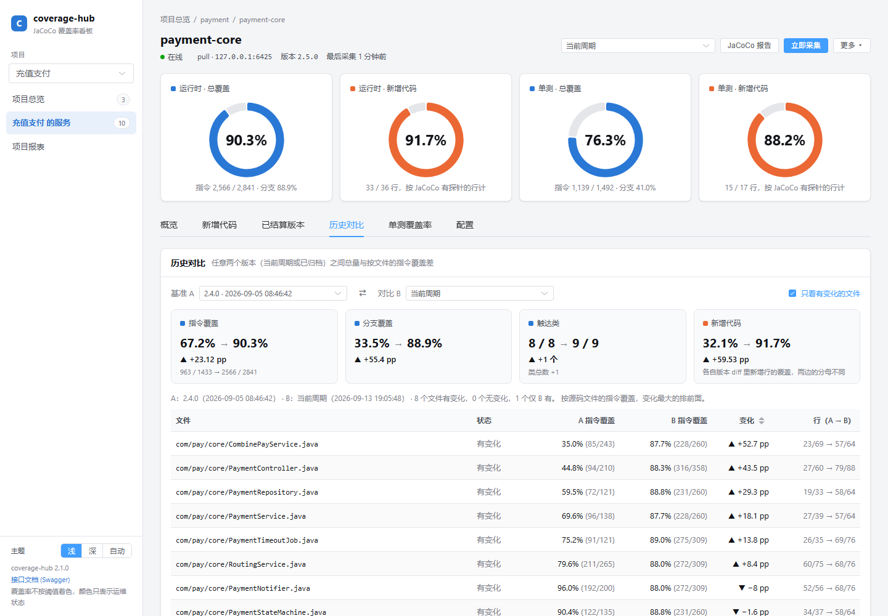
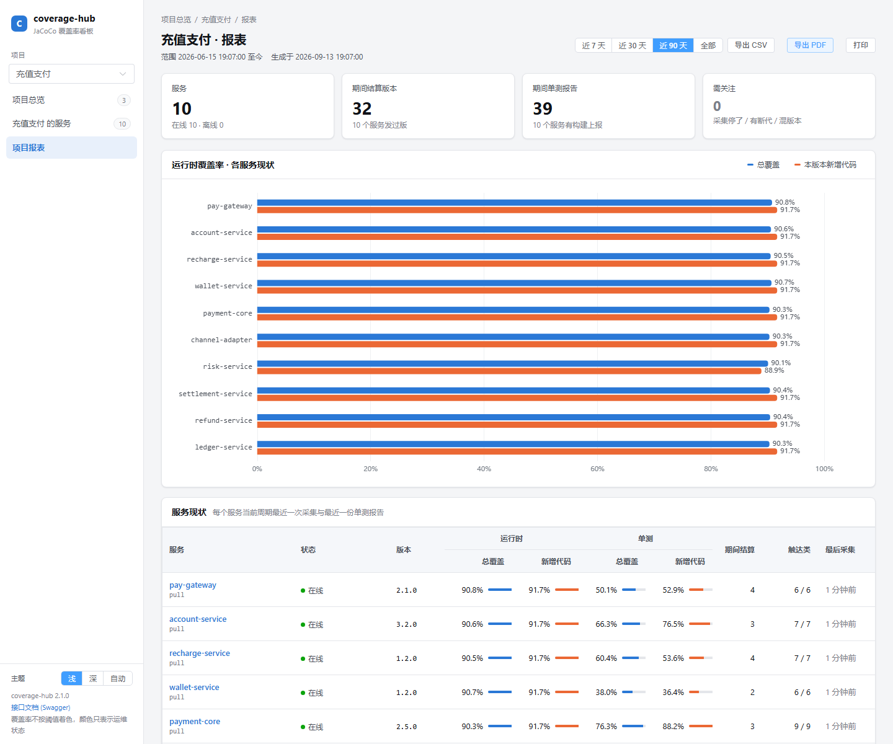
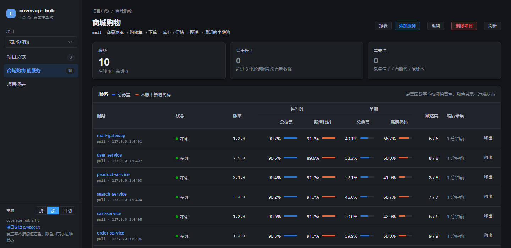
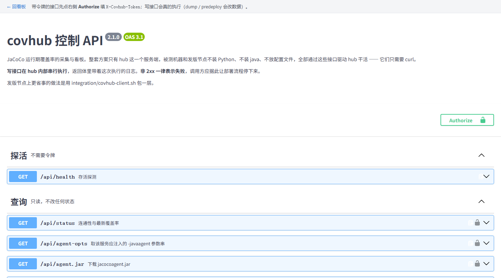

# coverage-hub v2.6.2

通用 JaCoCo 覆盖率方案：**运行期**随服务启动自动采集、发版前自动结算；**构建期**的单测
覆盖率与源码由流水线送进来，hub 比对两版源码得出 diff；一个 Vue 看板按项目 → 服务展示**总覆盖率**
与**本版本新增代码的覆盖率**（运行时、单测各一份）。

与被测服务无关 —— 任何 Java 服务只要能加 JVM 参数就能接入，不需要改被测项目的代码或 pom。

**整套方案只部署一个服务端。** 被测服务所在的机器、发版节点都不装 Python、不装
java、不放配置文件 —— 它们只需要 `curl`（`fetch-classes` 另需 tar；`upload-sources` 不给包时另需 git 与 tar），
以及被测 JVM 里挂的那个 `jacocoagent.jar`（push 通道再加一个 `covhub-agent.jar`；都能直接从 hub 下载）。

> **要接入一个新服务，直接看 [ONBOARDING.md](ONBOARDING.md)** —— 从搭建到验收的完整步骤、
> 四种部署方式的注入方法、验收清单和常见问题。本文说明的是设计与命令细节。
>
> **从 1.x 升级**：服务配置和覆盖率历史现在在数据库里，看板是独立前端。见 [§ 七 从 1.x 升级](#七从-1x-升级)。
>
> **建库建表 SQL**（MySQL 8，DBA 用）在 [docs/sql/](docs/sql/README.md)；各版本改动见 [CHANGELOG.md](CHANGELOG.md)。

---

## 效果图

本机起了 `tools/seed_demo.py` 灌的两个演示项目、20 个服务（`tools/demo_services.py` 把它们跑成真实 JVM），截图如下。

**项目总览** —— 首页只有项目卡片：服务数、在线 / 离线、每个服务的运行时总 / 新增、单测总 / 新增。



**项目面板** —— 项目下的服务表；添加服务勾选即生效，右上角进报表。



**服务详情** —— 四个环形指标（运行时 / 单测 × 总 / 新增）、趋势图；右上角版本下拉切历史版本，「立即采集」「结算归档」手动触发。



**历史对比** —— 任意两个版本的总量差与按文件的指令覆盖差。



**项目报表** —— 时间范围内的服务现状、已结算版本、单测报告，可导出 CSV / PDF。



**深色主题** —— 侧栏底部切换，默认跟随系统。



**在线接口文档** —— hub 自带 Swagger UI（`/docs`），不引 CDN。



---

## 一、运行期覆盖率

### 1. 服务启动时开始采集

给被测服务注入 agent（默认的 pull 通道是 `output=tcpserver`，hub 连过去取数；push 通道见下面第 5 节）。
**用环境变量注入，不需要改镜像、不需要改启动类**：

```bash
export JAVA_TOOL_OPTIONS="$(covhub-client.sh agent-opts my-service)"
# 然后照常启动服务
```

`agent-opts` 会根据 hub 上该服务的配置生成完整参数串，例如：

```
-javaagent:/opt/jacoco/jacocoagent.jar=output=tcpserver,address=0.0.0.0,port=6300,includes=com.example.*,classdumpdir=/tmp/covhub-classes/my-service,sessionid=1.4.2
```

`JAVA_TOOL_OPTIONS` 是 JVM 标准环境变量，`java -jar`、Spring Boot、Tomcat、`run-java.sh`、K8s 都认，无需关心服务是怎么启动的。
push 通道配了 `covhubAgent` 时参数串是**空格隔开的两个 `-javaagent`**，所以赋值时整串要像上面那样用双引号包住。

### 2. 重启 / 发版前自动 dump

```bash
covhub-client.sh predeploy my-service 1.4.2      # 发版节点，只要 curl
python covhub.py predeploy my-service --version 1.4.2   # 或在 hub 本机
```

它会：dump 并 `--reset` → 生成终版报告 → **体检 exec 与 class 指纹对不对得上** → 连同该周期全部 exec 归档到 `data/<service>/versions/1.4.2/` → 在数据库里记一条归档（含体检结论）。

体检匹配率低时会大声告警，但**不会阻断结算**：走到这一步服务马上要停，exec 是不可再生的 ——
因为指纹对不上就拒绝归档，只会让这段数据既对不上、又没留下。

> **顺序不能反。** 服务一停，agent 随之消失，那段覆盖率数据永久丢失。`predeploy` 必须在停服之前执行 —— 把它放进部署脚本的第一步。

命令在目标不可达时会**报错退出**（HTTP 409），这是有意的：让部署流程停下来，而不是静默丢数据。确实需要跳过时用 `--allow-missing`。

### 3. 实时在线查看

```bash
python covhub.py serve --with-watch    # 看板 + 控制 API + 定时采集 + push 收集端，一个进程全包
```

看板是独立的 Vue 前端（产物在 `web/dist`，进版本库，hub 机器不装 node；默认前后端分离部署，
见[部署形态](#部署形态)）：层级是**项目 → 服务**：首页只列项目
（卡片上有服务数、在线/离线、每个服务的运行时总/新增与单测总/新增覆盖率），新建项目也在这里，编辑 / 删除项目在项目面板右上角；
进项目是它的服务面板（在线状态、版本、运行时总/新增、单测总/新增、触达类数，能从「未分组」里添加服务、
把服务移出）；再进服务是详情页：四个环形指标（运行时 / 单测 × 总 / 新增）、趋势图、新增代码按文件的覆盖明细（点开看源码与逐行执行状态）、
已结算版本、历史对比、单测覆盖率（含单测历史）、配置，并能下钻到 JaCoCo 原生报告看到具体哪一行被执行过。

详情页右上角的版本下拉、「JaCoCo 报告」、「立即采集」和「更多」菜单（结算归档 / 重出报告 / 导出 PDF 报告 / 刷新）是给测试同学用的，
另有「历史对比」页签：

- **版本下拉**：切到任一已结算（或重启封存）的历史版本，运行时的数字、新增代码明细、源码视图、报告链接都变成那一版结算时的
  （URL 是 `#/services/<svc>?v=<归档目录>`，能收藏能转发）。历史版本的源码来自结算时存进归档的片段，不依赖源码目录还在。
- **立即采集**：跑完一轮用例点一下，马上把这一刻的覆盖率拉下来出报告，不用等下一轮轮询；hub 的执行日志原样弹出来。
- **更多 → 结算归档**：等价于 `predeploy`，弹窗里填版本号；**发版前、停服前**做。「重出报告」是改了 `reportExcludes` 之后用的。
- **历史对比**页签（不在右上角）：任选两个版本（当前周期或任一归档）做基准 A → 对比 B，看指令 / 分支 / 触达类 / 新增代码的差，
  以及按源码文件的指令覆盖差（变化最大的排前面，只在一侧出现的文件单独标出）。默认 A = 上一次归档、B = 当前周期。

项目面板右上角（以及侧栏「项目报表」）有**报表**：一页看完项目下所有服务的现状（横条图 + 表）、某段时间内（7 / 30 / 90 天或全部）结算过的版本和
收到的单测报告，可**导出 PDF**、导出 CSV（Excel 直接开）或打印。报表不给项目平均覆盖率 —— 各服务代码量差异很大，平均数没有意义。

**导出 PDF 有两级**：项目报表页的「导出 PDF」是项目级；服务详情页「更多 → 导出 PDF 报告」是服务级，会把概览、新增代码、已结算版本、
单测、配置五个页签一起排进一份（历史对比不含）。PDF 在浏览器里生成（页面画成高清位图后按 A4 横向分页），一律浅色底，不依赖 hub 装任何东西，
也不需要外网；代价是里面的文字不能选中，要文本数据用 CSV。

看板有浅色 / 深色两套主题（侧栏底部切换，默认跟随系统；地址里带 `theme=light|dark|system` 可强制），系列色与状态色两套主题相同。

**覆盖率数字不按阈值着色**（运行期 13% 不等于「差」，按阈值标红只会训练人无视颜色），语义色只给
运维状态：离线、采集停了、有断代、混版本。

单次采集用 `covhub-client.sh dump my-service`（累加，不清零）。

### 4. 不依赖研发的采集

出报告要两样东西：exec，和**产生这批 exec 的那份 class**。后者过去要靠被测项目的
构建流水线归档，这是整套方案里唯一需要研发配合的地方，也是最容易出错的地方 ——
class 对不上，报告不会报错，只会全红。

v1.1.0 把这两件事都挪到了运行期：

**class 由 agent 自己交出来。** 服务配置里加一项 `classDumpDir`，agent 会把它实际加载
到的每一个 class 落盘。这份 class 与 exec 的指纹不是「应该匹配」，是定义上必然匹配。
服务起来之后，由部署侧把这个目录送到 hub（一条命令，不碰研发的任何流程）：

```bash
tar czf cls.tgz -C /tmp/covhub-classes/order-service .
covhub-client.sh upload-classes order-service 1.4.3 cls.tgz --retarget
```

> 落盘的文件名形如 `OrderService.3f2a91c4e8b70d15.class`，指纹就在文件名里 ——
> 这个目录可以直接当 `classfiles` 用。另一个附带好处：Spring AOP、MyBatis 代理这类
> **运行时生成的类**在构建产物里根本不存在，只有 agent 见过。

**版本切段由 hub 自己发现。** 每次采集时读 exec 里的 `SessionInfo`，被测进程的
启动时刻一旦变化，就说明它重启过 —— hub 会自动把上一周期结算归档、开新桶，并记一条断代。
它**不能替代** `predeploy`：最后一次成功 dump 到重启之间的数据还是丢了，丢失上界等于
轮询间隔。自动检测的价值在于堵住 predeploy 覆盖不到的洞：手工重启、OOM 被杀、K8s 驱逐。

### 5. 多副本 / 不能开入站端口：push 通道

默认的 `pull` 通道要求 covhub 能连到被测端的 agent 端口。三种场景下这个前提不成立：
被测端不允许开入站端口、容器网络只出不进、多副本还会自动扩缩。

这时把服务配成 `push`，方向反过来 —— agent 主动连回 hub（hub 配置里要有 `collect` 段）：

```bash
covhub service add order-service --channel push --includes 'com.example.order.*' \
    --class-dump-dir /tmp/covhub-classes/order-service --classfiles ./data/order-service/artifacts/1.4.3
```

**多副本天然汇聚**：每个副本各连一条，hub 每轮向所有在线实例各取一次数，出报告时一起合并；
副本扩缩不用改任何配置。

push 通道下 `agent-opts` 给出的是**空格隔开的两个 `-javaagent`**（整串照旧塞进 `JAVA_TOOL_OPTIONS`）：

```
-javaagent:/opt/jacoco/jacocoagent.jar=output=none,includes=com.example.order.*,excludes=covhub.agent.*:org.jacoco.agent.rt.*,classdumpdir=/tmp/covhub-classes/order-service,sessionid=order-service -javaagent:/opt/jacoco/covhub-agent.jar=address=covhub.internal,port=6400,idle=900
```

JaCoCo 只插桩不联网（`output=none`），连 hub 的事交给 **`covhub-agent.jar`**（配置项 `covhubAgent`，
`covhub-client.sh fetch-covhub-agent` 下载）。不直接用 JaCoCo 自带的 `output=tcpclient`，是因为它有
两个改不了的行为：

| | `output=tcpclient` | `covhub-agent.jar` |
|---|---|---|
| 启动时 hub 不可达 | agent 初始化抛异常，**被测 JVM 起不来** | 照常启动，后台退避重试（1 秒起、30 秒封顶），只在第一次失败时打一行日志 |
| hub 重启 / 连接断开 | **不再重连**，要等被测服务重启 | 自己连回来 |
| 收不到 FIN 的断线（hub 掉电、NAT 回收空闲连接） | 永远挂着 | `idle` 秒没收到指令就重连（`agent-opts` 按三轮轮询间隔给，不低于 180 秒） |

它是 `agent/` 下的一个类（零依赖、Java 8 字节码），数据经 JaCoCo 的公开入口 `org.jacoco.agent.rt.RT`
取，线上说的仍是 JaCoCo 的 remote control 协议 —— hub 的收集端不用区分对面是谁，JaCoCo 的 jar 也不用改。
任何失败都只打日志（前缀 `[covhub-agent]`），不影响被测应用。**没配 `covhubAgent` 的老部署原样是
`output=tcpclient`**；配上之后重新取 `agent-opts`、下次重启被测服务时换上即可。进程退出前那一小段
数据仍然要靠 `predeploy` 结算，它不会在退出时主动推数据。

三个限制：**push 通道要求 `serve --with-watch`**（连接握在收集端手上，另起的 `watch` 进程够不着）；
**收集端口没有认证**，靠网络策略限制来源；push 下断代检测抓的是**混版本**（滚动发版中途新旧副本
同时在线）而不是重启，检出时只告警不自动封存，版本切段仍靠 `predeploy`。

> 协议是自己实现的：`jacococli` 只有 `dump`（去连 tcpserver），没有收集端命令。
> 实现在 `covhub/exec_format.py` 与 `covhub/collector.py`，格式常量是从真实 exec 文件头
> 实测出来的，`tests/test_exec_format.py` 用真实文件做读写往返的字节级比对。

### 6. 报告全红了怎么查

```bash
covhub-client.sh diagnose order-service
```

它把 exec 里记录的 class 指纹和 `classfiles` 的指纹求交集，直接给结论（匹配率、会话数、断代记录）。
接入时最贵的几个坑都能当场定位，不用靠经验猜。

### 为什么必须按版本切段

JaCoCo 用类的 CRC64 指纹（class id）把 exec 数据和 class 文件对应起来。**发版换了 class，旧 exec 就作废了** —— 拿新 class 去渲染旧 exec，只会得到一份"全部未覆盖"的假报告。

所以运行期覆盖率不能像单元测试那样一直累加，必须以版本为周期：一个版本一个采集周期，发版时 `predeploy` 结算归档，新版本从零开始。归档目录里的 `manifest.json` 记录了该 exec 对应哪份 class 产物，是日后重新出报告的唯一依据。

---

## 二、构建期：单测覆盖率与新增代码覆盖率

看板上的「单测」两列和「新增代码」两列来自构建流水线送进 hub 的两样东西：单测 `jacoco.xml` 和源码。
源码传上去之后 hub 自己比对两个版本得出 diff，报告也靠它下钻到行。每步都是一条 curl，
`Jenkinsfile.build` 里有现成的阶段（`Push to covhub`）。

### 1. 单测覆盖率：把 jacoco.xml 传给 hub

被测项目加了聚合模块（`integration/maven-aggregate-module/`，要改 pom，可选）之后，`mvn verify`
会产出 `coverage-report/target/site/jacoco-aggregate/jacoco.xml`。流水线把它 POST 给 hub：

```bash
covhub-client.sh unit-coverage order-service 1.4.3 coverage-report/target/site/jacoco-aggregate/jacoco.xml
```

hub 解析计数器入库（指令 / 分支 / 行 / 类），XML 原文留在 `data/<svc>/unit/<version>/`。
一个仓库多个服务时一份报告可以落多个服务（HTTP 接口带 `services=a,b`；CLI 与 covhub-client.sh 不支持），或用 `--group <artifactId>`
只取聚合报告里的一个模块。

### 2. 新增代码覆盖率：源码传给 hub，diff 由 hub 比对两版源码生成

hub 不碰代码仓库，也不要构建节点有 git 历史。流水线在仓库里（checkout 完）一条命令把这一版的源码传上来：

```bash
covhub-client.sh upload-sources order-service 1.4.3        # 当前 git 仓库里现打；也可以给现成的 tar.gz / zip
```

hub 存好源码后，拿**基线版本**的源码和它做 `git diff --no-index -M`（识别重命名，挪代码不算新代码），
得到和流水线 `git diff` 同形的 diff，记下每个源码文件的新增行号；之后**每次运行时快照**都按它算
「本版本新增行的覆盖」，单测报告到达时也算一份。三个数据（快照、单测 XML、源码）到达顺序不限，
晚到的会把已有的重算一遍，已归档的版本也会回写。

这样做是因为在构建节点上 `git diff <上一版>..HEAD` 的前提常常不成立：Jenkins `cleanWs` 过的工作区、
浅克隆、只拉一个 tag，都让 `rev-parse` 找不到上一版的 commit，diff 静默变空。hub 手里按版本存着
源码，两棵树一比就是 diff。**hub 机器要装 git**。

仍想自己算 git diff 的项目可以继续传（`diff <svc> <ver> covhub.diff --base <commit>`，推荐命令见
`covhub-client.sh` 的注释），而且人工上传的优先：之后 `upload-sources` 不会用自动生成的覆盖它。
要换回 hub 比对的结果就显式调一次：

```bash
covhub-client.sh diff order-service 1.4.3 --from-sources [--base 1.4.2]
```

**分母口径**：diff 新增行里 **JaCoCo 有探针记录的行**（空行、注释、import、纯声明没有探针，本来
就不参与覆盖率），分子是其中被执行到的行（含部分覆盖，和 LINE 计数器同口径）。删除的行、只改
不增的行不参与。没有可覆盖的新增行时显示「无新增」而不是 0% 或 100%。

**基线怎么定**：基线是一个**版本**，不给时 hub 按「服务当前 `version`（线上跑着的那版）→ 最近结算的版本
→ 最近上传过源码的版本」找第一个传过源码的。第一次接入时还没有基线，源码照收、diff 为空（返回体
`diffReason` 说明原因），下一版就有了。`--base 1.4.2` 可以显式指定。自己算 git diff 的项目仍可用
`covhub-client.sh last-version <svc> --plain | cut -f2` 问上一次结算的版本对应的 commit。

**版本串必须一致**：构建时给的 `version`、发版时 `predeploy` / `retarget` 用的 `version`、快照里记的
`version` 三处要是同一个字符串，hub 才能把 diff 和快照对上。`upload-sources` / `diff` 的返回体里
`matchesCurrentVersion` 为 false 就是在提醒这件事。

**diff 里有、报告里没有的源码文件**（被 agent 的 `excludes` 排掉，或不在 `classfiles` 里）会单独列在
`unmatched` 里，看板上有中性提示 —— 它们从分母里消失比算错更糟。

### 3. 源码还让报告下钻到行、新增代码看整个文件

同一份上传的源码还有第二个用处：hub 独立部署，本机没有源码，JaCoCo 报告和看板都靠它。
`upload-sources` 打的是受版本控制的 `.java/.kt/.groovy/.scala`（去掉 `src/test/`），路径相对仓库根。
hub 存到 `data/<svc>/sources/<版本>/`，按每个文件的 `package` 声明识别源码根（多模块、非标准布局都行），之后：

- **JaCoCo 报告**出报告时按版本带上源码，类页面能看到逐行的红绿标记。HTML 生成时把源码内嵌进去，归档报告不再依赖它；
- **看板「新增代码」**能看整个文件（「展开全文」），服务发了新版本之后，旧版本的也照样对得上；
- 该版本已有 diff 时顺手把新增行附近的片段补进 `incremental.json`。

hub 只收源码文件，配置文件之类即便混进包里也不落盘；`sources/` 目录**不经静态路径外发**，只通过报告与
源码视图接口出去（都要令牌）。版本串同样要和 `predeploy` / `retarget` 用的一致 —— 出报告按服务当前
`version` 找源码。

---

## 三、Jenkins 接入

见 `integration/jenkins/`：一个 Shared Library（`vars/covhub.groovy`）加两条流水线模板。

- `Jenkinsfile.build` —— 构建期：跑测试 → 聚合报告 → **推单测报告与源码给 hub**（diff 由 hub 比对得出）→ 归档 class 产物（可选）
- `Jenkinsfile.deploy` —— 发版：结算旧版本 → 取新版本 class 产物 → 部署（agent jar 从 hub 取，push 通道两个都取）→ 指向新产物 → 确认采集恢复并校验指纹

安装步骤、节点前置条件与各步骤的注意事项见 `integration/jenkins/README.md`。

---

## 四、单点部署与远程 API

**服务端只有一个。** 真正需要"在别处执行"的只有构建和发版时那几步，它们都是 HTTP 接口，由 hub 代劳：

| 接口 | 方法 | 用途 |
|---|---|---|
| `/api/health` | GET | 存活探测，不需要令牌 |
| `/docs` | GET | 在线接口文档（Swagger UI，hub 自己托管），不需要令牌 |
| `/api/login` | POST | 用令牌（`X-Covhub-Token` 头）换一个 Cookie，看板的登录入口；没配令牌时返回 `tokenRequired: false`、不种 Cookie |
| `/api/status[?service=X]` | GET | 连通性与最新覆盖率（JSON） |
| `/api/agent-opts?service=X` | GET | 该服务应注入的 `-javaagent` 参数串（加 `&format=text` 出纯文本） |
| `/api/agent.jar` | GET | 下载 `jacocoagent.jar` |
| `/api/covhub-agent.jar` | GET | 下载 `covhub-agent.jar`（push 通道连 hub、断线重连的薄 agent；没配 `covhubAgent` 时 404） |
| `/api/diagnose?service=X[&version=V]` | GET | 诊断 exec 与 class 是否对得上 |
| `/api/dump?service=X` | POST | 拉一次快照（累加） |
| `/api/predeploy?service=X&version=V` | POST | 结算并归档；加 `&allowMissing=1` 允许目标已离线 |
| `/api/report?service=X` | POST | 用已有 exec 重出报告 |
| `/api/retarget?service=X&version=V[&classfiles=/a,/b][&sourcefiles=/s]` | POST | 更新版本与 class 产物 / 源码路径 |
| `/api/upload-classes?service=X&version=V[&retarget=1]` | POST | 上传 class 产物压缩包（tar.gz / zip，正文为二进制） |
| `/api/classes?service=X&version=V` | GET | 把该版本的 class 产物打成 tar.gz 回传 |
| `/api/upload-sources?service=X&version=V[&base=B][&diff=skip]` | POST | 上传该版本的源码压缩包（tar.gz / zip，正文为二进制），hub 顺带比对基线版本的源码生成这一版的 diff；报告下钻到行、新增代码看全文也靠它。`services=a,b` 可一份落多个服务 |
| `/api/unit-coverage?service=X&version=V[&group=M]` | POST | 上传单测 jacoco.xml（正文为文件）；`services=a,b` 可一份落多个服务 |
| `/api/diff?service=X&version=V&from=sources[&base=B]` | POST | 让 hub 比对该版本与基线版本已上传的源码生成 diff（不读正文）；`services=a,b` 可一份落多个服务 |
| `/api/diff?service=X&version=V&base=B[&head=H]` | POST | 上传流水线自己算的 git diff（正文为文件），优先于自动生成的；`services=a,b` 可一份落多个服务 |
| `/api/recompute?service=X[&version=V]` | POST | 按已有 diff 重算新增代码覆盖（没有 diff 等业务失败是 409） |
| `/api/services`、`/api/services/{name}` | GET / POST / PUT / PATCH / DELETE | 服务配置的增删改查 |
| `/api/projects`、`/api/projects/{name}` | GET / POST / PATCH / DELETE | 项目（服务分组）的增删改查 |
| `/api/export` | GET | 导出全部项目与服务配置（与 `covhub export` 同形，可作 import 的输入） |
| `/api/import[?source=路径][&overwrite=1][&dryRun=1]` | POST | 导入 **hub 本机**某个配置文件（不读请求正文，缺省用当前配置文件）里的项目与服务配置（旧 targets.yaml 或 export 的输出）及 data/*/state.json 里的历史 |
| `/api/overview` | GET | 看板首页数据 |
| `/api/services/{name}/detail[?version=D]` | GET | 服务详情页数据；带 `version`（归档目录名）时看那个历史版本 |
| `/api/services/{name}/source?file=F[&kind=unit][&version=D][&full=1][&context=3]` | GET | 某个文件新增代码的源码与逐行覆盖状态；`context` 是新增行前后带几行（0–20）；`full=1` 给整个文件（该版本传过源码时） |
| `/api/services/{name}/compare?a=A&b=B` | GET | 两个版本的对比（`current` 或归档目录名）：总量差 + 按源码文件的指令覆盖差 |
| `/api/services/{name}/versions` | GET | 最近结算的版本与 diff 的 head（流水线定基线用） |
| `/api/projects/{name}/report[?days=30]` | GET | 项目报表：各服务现状 + 时间范围内的结算版本与单测报告（`days=0` 不限，最大 3650）；`{name}` 为 `__unassigned` 时是未分组的服务 |

写操作在 hub 内部串行执行，返回体里带着这次执行的日志；**HTTP 非 2xx 表示失败**，
调用方应当据此让部署流程停下来。上传类接口的正文是原始文件，用 `curl --data-binary`（`-d` 会吃掉换行）。

发版节点上用 `integration/covhub-client.sh` 包一层，只依赖 curl：

```bash
export COVHUB_URL=http://covhub.internal:8900
export COVHUB_TOKEN=<hub 上配的 serve.token>
# 可选：COVHUB_TIMEOUT（单请求上限，默认 600 秒）、COVHUB_CONNECT_TIMEOUT（默认 10）、
#       COVHUB_POLL_INTERVAL（wait-online 轮询间隔，默认 5）；完整子命令见 covhub-client.sh help

covhub-client.sh predeploy      order-service 1.4.2      # 1. 结算，必须在停服之前
deploy.sh 1.4.3                                          # 2. 你自己的部署
covhub-client.sh upload-classes order-service 1.4.3 \
                 cls.tgz --retarget                      # 3. 产物传给 hub 并指过去
covhub-client.sh wait-online    order-service            # 4. 确认新实例采集恢复
```

### 部署形态

前后端是两个交付物：Python 包（API + 采集 + 报告目录）和前端产物（`web/dist`，进版本库）。
两种部署方式，接口和数据完全一样，区别只在谁来发那几个静态文件。
**照着做的完整步骤（含 nginx 配置、验证命令、对照排障表）在 [ONBOARDING §2](ONBOARDING.md#2-搭建-hub-与看板一次性)**，
这里只讲形态。

**一、前后端分离（默认）。** 前端产物交给 nginx，`/api/*`、`/docs`、`/swagger/*`、报告目录反代给 hub：

```sh
scp -r web/dist/* nginx机器:/opt/covhub-web/
# nginx 配置见 integration/nginx/covhub.conf
```

前端和 hub **必须落在同一个源下**（模板里就是这么配的）—— 控制面的鉴权认 Cookie，
hub 一个 CORS 头都不发，开跨域等于让任意页面替已登录的浏览器调写接口。

**二、hub 自己托管（单机够用）。** 把 `web/dist` 拷到 hub 机器上，配置里指过去，一个端口全包：

```yaml
serve:
  port: 8900
  token: "..."
  webDir: /opt/covhub/web     # 留空 = 不托管前端，根路径只给一页说明
```

不管哪种，`COVHUB_URL`（`covhub-client.sh` 和 Jenkins 库用的）都是 **hub 的 API 地址**，
不是看板地址：指 nginx 或直连 hub 的 8900 都行。

### 查看接口文档

**在线文档：`http://<hub>:8900/docs`**（看板侧栏底部也有入口）。这是 hub 自己托管的 Swagger UI，
资源打在 Python 包里（`covhub/static/swagger/`），不从 CDN 拉，内网能开，也不依赖前端有没有构建；
页面不要令牌。
带令牌的接口先点右上角 **Authorize** 填 `X-Covhub-Token`，之后 Try it out 每个请求都带上 ——
注意写接口会真的执行（`dump` / `predeploy` 会改数据）。

OpenAPI 描述内嵌在这个页面里，hub 不单独暴露 JSON 接口。要给 Apifox / 网关喂文件的话用仓库里的
`docs/openapi.json`（`python covhub.py openapi` 从接口定义导出，`--check` 校验是否过期）。

所有接口都不发 CORS 头 —— 鉴权认 Cookie，开跨域等于让任意页面替已登录的浏览器去调写接口。

### 访问控制

配了 `serve.token`（或给 hub 进程设了环境变量 `COVHUB_TOKEN`）之后，`/api/*` 和 `data/` 静态目录
（报告、jacoco.xml、`artifacts/` 里线上跑的字节码、`exec/` 里不可再生的执行轨迹）都要令牌；
只有 `/api/health`、`/api/login`、`/docs`（含 `/swagger/*`）和**自托管时的看板前端**
（`serve.webDir` 下的全部产物：`/`、`/assets/*`、`favicon.ico` 等，公开的构建产物，不含秘密）例外 —— 前端加载出来后会因为 API 401 弹出令牌输入框。

| 场景 | 怎么带 |
|---|---|
| 浏览器看看板 | 打开看板，在弹窗里填令牌 —— 它调 `POST /api/login` 换一个 `HttpOnly` Cookie，之后 API 和报告链接都放行。直接分享出去的报告链接仍可用 `?token=<serve.token>`，hub 种下 Cookie 再跳回干净地址 |
| `curl` / 流水线 | `-H "X-Covhub-Token: <token>"`（`/api/*` 也认 `?token=`，但会进访问日志，不推荐） |
| 客户端脚本 | 设 `COVHUB_TOKEN` 环境变量 |

agent 的 tcpserver 端口和 push 通道的收集端口（`collect.port`）**没有认证**，靠防火墙或安全组限定来源。

---

## 五、配置

配置分两处：

**hub 级配置在文件里**（`covhub.yaml`，也可 `covhub.json`；旧名 `targets.*` 继续认）。`-c` 不给时按
`covhub.yaml` → `covhub.yml` → `covhub.json` → `targets.yaml` → `targets.yml` → `targets.json` 探测。
可从 `covhub.example.yaml` 复制，或 `covhub.py init` 生成：

```yaml
jacocoAgent: ./lib/jacocoagent.jar   # 被测端能看到的路径，容器场景写容器内路径
covhubAgent: ./lib/covhub-agent.jar  # 同上。push 通道用它连 hub（hub 不在也能启动、断线自己重连）；
                                     # 不配则退回 JaCoCo 自带的 output=tcpclient
jacocoCli: ./lib/jacococli.jar
dataDir: ./data

database:
  url: mysql+pymysql://covhub:密码@主机:3306/covhub?charset=utf8mb4   # 环境变量 COVHUB_DATABASE_URL 优先
  autoUpgrade: true          # 启动时自动把表结构升到最新

serve:
  port: 8900
  token: ""                  # 控制 API 与静态目录的令牌，不配则谁都能访问
  webDir: ""                 # 配了才由 hub 自托管前端产物（默认分离部署，前端给 nginx）

watch:
  intervalSeconds: 300       # 轮询间隔，同时是断代时数据丢失的上界

collect:                     # push 通道的收集端，只有配了 port，serve 才会起它
  port: 6400
  bindAddress: 0.0.0.0
  advertiseAddress: covhub.internal   # 被测端能访问到的 hub 地址
  dumpTimeoutSeconds: 20
```

`database.url` 留空则用配置文件旁边的 SQLite（`covhub.db`，只适合单机试用；**故意不放 `dataDir`**，
那是看板的静态目录）。主验证数据库是 MySQL 8（驱动 PyMySQL），PostgreSQL 也能跑（`pip install
".[postgres]"`）。

**服务配置在数据库里**，用 CLI 或 API 登记（`service.example.yaml` 是 `--from-file` 的模板）：

```bash
python covhub.py project add shop --title "商城"
python covhub.py service add order-service --project shop --address 10.0.1.21 --port 6300 \
    --includes 'com.example.order.*' --class-dump-dir /tmp/covhub-classes/order-service \
    --classfiles ./data/order-service/artifacts/1.4.2 --version 1.4.2
python covhub.py service update order-service --report-excludes 'com/example/order/**/dto/**'
python covhub.py service show order-service
```

配置跟着数据库走：换一个库（比如在 `covhub_dev` 上调试完切回生产库 `covhub`）服务不会自己长出来，
用 `export` / `import` 搬：

```bash
python covhub.py export --out services.yaml                # 在旧库上导出项目 + 服务
COVHUB_DATABASE_URL=mysql+pymysql://...covhub python covhub.py import services.yaml   # 在新库上导入
```

`import` 幂等：已有的同名项目 / 服务默认跳过，`--overwrite` 才覆盖；服务引用的项目在新库里不存在时按
名字自动建出。`data/` 目录两套库可以共用（磁盘上只有采集产物，库里只有元数据），历史快照 / 归档
不随 export 走 —— `import` 会顺带从 `data/<svc>/state.json` 与 `versions/*/manifest.json` 补回归档记录，
1.x 之后没有 state.json 的服务只导配置。

| 字段 | 说明 |
|---|---|
| `name` | 服务名：只能用字母、数字、`. _ -`，不能以 `.` / `-` 开头；`api`、`assets`、`docs`、`swagger`、`agent.jar`、`index.html`、`favicon.ico` 是保留名 |
| `version` | 当前线上版本：pull 通道作 sessionid，`predeploy` / `upload-sources` 等缺省取它，必须与构建期传的版本串一致 |
| `project` | 所属项目名（先 `project add`），看板按它分组 |
| `channel` | `pull`（默认，hub 去连 agent）或 `push`（agent 连回 hub） |
| `address` / `port` | pull：covhub 连过去拉数据的地址；`bindAddress` 是 agent 在被测端监听的地址 |
| `includes` / `excludes` | **传给 agent 的**，类名用 `.` 分隔，决定是否插桩；改了要重启服务 |
| `classDumpDir` | 让 agent 把实际加载的 class 落到这个目录（**被测端路径**） |
| `classfiles` | 出报告用的 class（**hub 上**的路径），必须与运行中的服务是同一份产物。用 `upload-classes --retarget` 传上来会自动指过去 |
| `reportExcludes` | **报告端过滤**，Ant 风格路径（用 `/`），随时可改重出报告 |
| `sourcefiles` | 可选，**hub 本机**的源码路径，只在该版本没经 `upload-sources` 传过源码时兜底（且只对当前版本生效）。独立部署推荐流水线按版本上传，见「三、构建期」 |
| `sourceEncoding` | 默认 UTF-8 |
| `dumpRetry` | 可选，默认 3，服务刚起来时端口可能还没监听 |

`includes`/`excludes` 与 `reportExcludes` 是两个层次：前者决定**是否插桩**（被排除的类连数据都不会产生，事后无法找回），后者只影响**报告统计口径**。

`classfiles` / `sourcefiles` 里的相对路径库里存原文、读时相对配置文件目录展开，整个目录搬到别的机器
照样成立。**配置每次请求 / 每轮轮询重读**，`retarget` / `service update` 之后不用重启任何东西。

---

## 六、命令一览

全局参数：`-c/--config FILE` 指定配置文件（缺省按文件名探测），`-V` 打印版本。

| 命令 | 用途 |
|---|---|
| `init [--json]` | 生成 hub 配置模板 `covhub.yaml` |
| `db upgrade [revision] / current` | 建表 / 升级表结构（`database.autoUpgrade` 开着时除 `init` / `db` 外任何命令启动都会自动做）；`db revision -m 说明 [--empty]` 给开发者生成迁移脚本 |
| `project list [--json] / show / add [--title] [--description] / update / remove --yes` | 项目（服务分组） |
| `service list [--project P] [--json] / show / add / update [--no-project] / remove --yes / template` | 服务配置（存数据库）；`add` / `update` 支持 `--from-file` |
| `export [--out FILE] [--json]` | 把库里的项目与服务配置导成文件（换库、备份用） |
| `import [文件] [--dry-run] [--overwrite]` | 导入项目与服务配置（旧 `targets.yaml` 或 `export` 的输出）与 `data/*/state.json` 的历史，幂等 |
| `agent-opts <service>` | 打印启动时应注入的 `-javaagent` 参数串（push 通道配了 `covhubAgent` 时是空格隔开的两个） |
| `status [service]` | 目标连通性与最新覆盖率 |
| `dump <service>` | 拉一次快照并出报告（累加，不清零） |
| `predeploy <service> [--version V] [--allow-missing]` | 发版/重启前结算：`dump --reset` + 归档；目标已离线时默认报错，`--allow-missing` 放行 |
| `report <service>` | 用已有 exec 重新出报告（改了 `reportExcludes` 后用） |
| `diagnose <service> [--version V] [--json]` | 诊断 exec 与 class 产物是否对得上 |
| `retarget <service> --version V [--classfiles ...] [--sourcefiles ...]` | 发版后把服务指向新版本产物 |
| `unit-coverage <service> [version] <jacoco.xml> [--group M]` | 收一份单测报告 |
| `diff <service> <version> --from-sources [--base V]` | 比对该版本与基线版本已上传的源码生成 diff |
| `diff <service> <version> <file> --base B [--head H]` | 收一份流水线算好的 git diff |
| `upload-sources <service> [version] <包或目录> [--base V] [--no-diff]` | 收一份某版本的源码并生成这一版的 diff（hub 本机 checkout 的目录也能转成按版本存） |
| `recompute <service> [--version V]` | 按已有 diff 重算新增代码覆盖 |
| `openapi [--out docs/openapi.json] [--check]` | 导出 / 校验接口文档 |
| `watch [--interval N]` | 守护进程，定时轮询全部目标 |
| `serve [--port N] [--with-watch] [--interval N]` | HTTP 服务：看板 + 控制 API，`--with-watch` 顺带在同进程里采集（push 通道必须），`--interval` 覆盖轮询间隔 |

依赖：Python 3.12、`java` 8+、FastAPI + uvicorn、SQLAlchemy 2 + Alembic、pydantic v2、PyYAML、PyMySQL
（`pip install .`；PostgreSQL 加 `[postgres]`）。`lib/` 下三个 jar 都在版本库里：JaCoCo 的 `jacocoagent.jar` /
`jacococli.jar`，和自带的 `covhub-agent.jar`（源码在 `agent/`）—— hub 机器只要 JRE，不需要 JDK。**uvicorn 必须单 worker**：收集端握着长连接、采集线程
和 API 共用一把进程锁，多 worker 就是多份收集端抢端口、多份采集重复取数。

---

### 演示数据

想先看看板长什么样，`python tools/seed_demo.py` 会往当前 hub 里灌两个项目（商城购物、充值支付）各 10 个微服务、
每个服务 3–5 个版本的完整数据（快照、归档、diff、单测报告，磁盘上带 jacoco.xml / 报告 / 源码片段），
`--reset` 先清掉上次灌的。再跑 `python tools/demo_services.py start`（要 JDK）会把这 20 个服务真的起成 20 个
小 JVM（各 48 MB 堆，挂 JaCoCo agent，随机调自己的方法），hub 就能实时采到数据；`stop` 停掉、`status` 看谁在跑。
不起 JVM 的话看板上是离线 / 未知。

## 七、从 1.x 升级

1. 装依赖：`pip install .`（内网机器提前准备 wheel）。
2. hub 配置文件改名 `covhub.yaml`（不改也行，旧名继续认），加 `database.url`。
3. `python covhub.py db upgrade` 建表。
4. `python covhub.py import` 把旧 `targets.yaml` 里的 `services` 和每个服务的 `data/<svc>/state.json`、
   `versions/*/manifest.json` 导进库（幂等，可重跑；`--dry-run` 先看）。
5. 从配置文件里删掉 `services:` 段（残留会每个进程提醒一次）。
6. 起 `serve --with-watch`。旧看板 `data/index.html` 会被自动改名 `.legacy`。
7. 发版流水线不用改：接口路径与返回体和 1.x 逐字段兼容。想要单测 / 新增代码覆盖率再给构建流水线
   加 `Push to covhub` 那一步。

### 从 2.5 及更早升级到 2.6（只关系到 push 通道）

升级本身不用做任何事：没配 `covhubAgent` 的 hub 照旧给 push 服务生成 `output=tcpclient`，已经在跑的实例
不受影响（hub 启动时会提醒一行）。要换上 `covhub-agent`（hub 不在也能启动、断线自己重连）：

1. `covhub.yaml` 加一行 `covhubAgent: <被测端路径>`，通常和 `jacocoAgent` 同目录（配置每次请求重读，不用重启 hub）。
2. 被测端取 jar：`covhub-client.sh fetch-covhub-agent <同一个路径>`（容器场景放进挂载目录 / initContainer 多下一个）。
3. 重新取 `agent-opts`，下次重启被测服务时生效 —— 参数串变成两个 `-javaagent`，**拼 `JAVA_TOOL_OPTIONS`
   的地方要带引号**（仓库里的模板都带了；自己写的部署脚本检查一下）。

---

## 八、目录布局

数据库（`covhub/db/models.py`）：`projects`、`services`、`service_state`（会话基线、在线状态）、
`snapshots`（每次采集的统计 + 新增覆盖）、`archives`（每次结算）、`breaks`（断代）、`unit_reports`、`diffs`。

磁盘（`dataDir`）：

```
data/
  <service>/
    current/                    当前版本周期的最新报告（html/、jacoco.xml、jacoco.csv、incremental.json）
    exec/<时间戳>.exec           本周期历次快照
    versions/<版本>/             周期结算归档（报告 + exec + merged.exec + manifest.json + incremental.json，后者含新增行附近的源码片段）
    artifacts/<版本>/            经 upload-classes 传上来的 class 产物
    classes/                    按 reportExcludes 过滤后的 class 副本
    unit/<版本>/                 单测 jacoco.xml + incremental.json
    diff/<版本>.diff、.lines.json  git diff 原文与新增行号
    sources/<版本>/              经 upload-sources 传上来的源码（仓库相对路径 + .roots.json），不经静态路径外发
```

`data/<service>/versions/` 下的 exec 是**不可再生**的真实执行轨迹。需要长期留存的话请归档到对象存储或制品库，别指望 git。

---

## 九、注意事项

- **控制 API 的写接口能清零计数器**（`predeploy` 带 `--reset`）。配上 `serve.token`，并且不要把 8900 暴露到公网。
- **tcpserver 端口与 push 收集端口没有认证。** 生产/共享环境务必用防火墙或安全组限制来源。
- **上传接口走的是原始正文**，前面有 nginx 的话把 `client_max_body_size` 调到能装下聚合 XML（几十 MB）。
- **性能开销通常在个位数百分比**，可用于测试环境常驻，但不建议长期挂在生产上。
- **归档不会被覆盖。** 同名版本已有归档时会自动存成 `<版本>-2`。
- **改前端要在开发机构建**：`cd web && npm ci && npm run build`，产物 `web/dist` 和源码一起提交；hub / nginx 机器不需要 Node。
- **改 covhub-agent 也在开发机构建**：`sh agent/build.sh`，Windows 上是 `powershell -ExecutionPolicy Bypass -File agent\build.ps1`（都要 JDK 9+，两个脚本等价），
  产物 `lib/covhub-agent.jar` 和源码一起提交；
  被测端要重新 `fetch-covhub-agent` 并重启服务才换上新的。它对 JaCoCo 只用反射，换 JaCoCo 版本不用重编。
- **covhub-agent 不在进程退出时推数据。** 被测服务停掉前的最后一段覆盖率仍然只有 `predeploy` 能留下。
- **覆盖率不是质量指标。** 它只说明代码被执行过，不说明断言是否有效。分支覆盖率通常比指令覆盖率更有参考价值。
